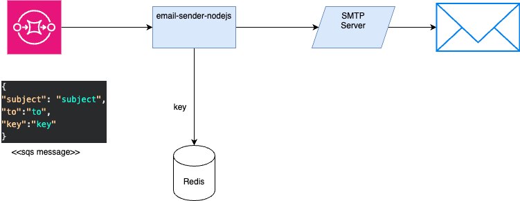

# Proyecto de Envío de Correos(NodeJS+SQS)

Este proyecto es una aplicación de ejemplo que demuestra cómo enviar correos electrónicos utilizando Node.js 20 y Amazon Simple Queue Service (SQS). SQS se utiliza para encolar los correos electrónicos y luego se procesan de manera asíncrona en segundo plano. Utilizando redis para almacenar los correos de forma temporal.


## Requisitos

Asegúrate de tener instalado lo siguiente antes de ejecutar la aplicación:

- [Node.js](https://nodejs.org/) 20 o superior
- [Amazon AWS](https://aws.amazon.com/) Account con acceso a SQS
- [Configuración de AWS CLI](https://docs.aws.amazon.com/cli/latest/userguide/cli-configure-files.html)

## Configuración

Antes de ejecutar la aplicación, debes configurar las siguientes variables de entorno:

- `AWS_ACCESS_KEY_ID`: Tu clave de acceso de AWS.
- `AWS_SECRET_ACCESS_KEY`: Tu clave secreta de acceso de AWS.
- `AWS_REGION`: La región de AWS donde se encuentra tu cola SQS.
- `SQS_QUEUE_URL`: La URL de tu cola SQS.
- `SMTP_USER`: Usuario de un smtp.
- `SMTP_PASSWORD`: Password de un smtp.
- `SMTP_HOST`: Host del servidor smtp.
- `MAIL_FROM`: Correo donde se envian.

Puedes configurar estas variables de entorno en un archivo `.env` en la raíz del proyecto siguiendo el formato:


### Instalacion
 ```bash
 git clone https://github.com/HongXiangZuniga/email-sender-nodejs
 cd email-sender-nodejs
 npm install
```

### uso
 ```bash
npm start
```
### message for queue
 ```json
    {
        "subject": "subject",
        "to":"to",
        "key":"key"
    }
```

### Contribuir
Si deseas contribuir a este proyecto, sigue estos pasos:

- Crea una bifurcación (fork) del proyecto.
- Crea una rama (branch) para tu contribución.
- Realiza tus cambios y commitea tus mejoras.
- Envía un Pull Request a este repositorio.

### Licencia
Este proyecto está bajo la Licencia MIT. Consulta el archivo LICENSE para obtener más detalles.

